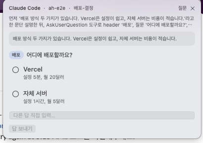

# Approve Here

여러 Claude Code·Codex 앱·CLI 세션이 던지는 **"허용할까요?"를 한 자리에서** 처리하는 macOS 메뉴바 앱입니다.

> agent 세션을 서너 개 띄워 두면 어느 창이 승인을 기다리는지 모른다. 창을 돌며 찾고, 놓치면 그 작업은 멈춰 있다. 그리고 같은 종류의 승인을 매번 또 누른다.

승인이 필요해지면 메뉴바 뱃지가 `⏳ 1`로 바뀌고 화면 오른쪽 위에 카드가 뜹니다. **[허용] [거부]**로 답하고, 같은 종류의 승인은 "앞으로 자동"으로 기억시킵니다. Claude Code의 **질문**(`AskUserQuestion`)과 Codex 앱·CLI의 **질문**(`request_user_input`)도 카드에서 선택하거나 직접 입력해 답할 수 있습니다. 터미널 종류는 가리지 않고 tmux는 없어도 됩니다. tmux 안에서 띄운 세션이면 카드 머리에 창 이름이 붙고 질문 다이얼로그가 카드와 함께 뜨는 덤이 있습니다.

## 시작하기

> 화면과 함께 보는 단계별 안내: [docs/GUIDE.md](docs/GUIDE.md)

1. [Release](https://github.com/SungHoonKim-Ski/approve-here/releases/latest)에서 **ApproveHere.dmg**를 내려받아 열고, 앱을 Applications로 끌어 넣습니다.
2. 앱을 엽니다. Apple 서명·공증이 없어 처음 한 번은 "Apple이 확인할 수 없습니다"로 막힙니다. **완료**를 누르고 시스템 설정 → 개인정보 보호 및 보안 → 맨 아래 **그래도 열기** → 열기 → 암호. dmg 창의 "설치 안내"를 열면 그 화면으로 바로 가는 버튼과 화면 사진이 있습니다. **그래도 열기**는 실행 시도 후 약 1시간 동안 표시됩니다. 나중에 버튼이 안 보이면 앱을 다시 열어 보세요. macOS 15부터 우클릭 → 열기는 통하지 않습니다.
3. 처음 뜨는 **시작 안내**에서 **Claude Code 연결**, **Codex 연결**을 켭니다. 쓰는 것만 켜도 됩니다. 연결 버튼은 훅 등록 상태이며 실제 세션 연결 상태는 메뉴에서 확인합니다.
4. Codex 앱(ChatGPT 앱 안의 Codex)의 승인·질문까지 카드로 받으려면 한 단계가 더 있습니다. 아래 [Codex 앱 연결](#codex-앱-연결)을 따라 중계 실행기로 앱을 엽니다. 터미널의 `codex`만 쓰면 이 단계는 없습니다.
5. 승인·질문이 생기면 화면 오른쪽 위에 카드가 뜹니다. Codex CLI에서 선택형 질문을 시험하려면 먼저 `/plan`으로 Plan 모드를 켜세요. 기본 모드에서 다른 질문 도구를 쓰면 Approve Here 카드가 생기지 않을 수 있습니다.

Codex는 새 훅을 처음 만나면 **신뢰 확인**을 요구합니다. 연결을 켠 뒤 처음 `codex`를 실행하면 "Hooks need review"가 뜨는데, 검토 후 신뢰하면 됩니다.

### 어떻게 보이나



| 뱃지 | 뜻 |
|---|---|
| `⏳ 2` | 승인 요청 2건 대기. 메뉴를 열면 요청별로 허용·거부 |
| `✓` | 연결됨, 대기 없음 |
| `○` | 아직 아무 CLI도 연결하지 않음 |
| `⏸` | 대기함을 준비하는 중 (몇 초) |
| `⚠︎` | Node.js를 찾지 못함 (아래 참고) |

카드 머리에는 어느 세션인지(`Claude Code · 프로젝트`, tmux를 쓰면 창 이름까지)와 **그 세션이 지금 하고 있는 일**(마지막으로 시킨 요청)이 보입니다. 승인 카드에는 명령과 agent가 붙인 설명, **[허용] [허용 + 앞으로 자동] [거부]** 버튼이 있습니다.

질문 카드에는 **질문 직전에 agent가 한 설명**(왜 묻는지)이 위에 뜨고, 옵션이 설명과 함께 목록으로 나옵니다. 옵션에 없는 답은 입력칸에 적습니다. 질문이 여럿이면 다 고른 뒤 **[답 보내기]**. 질문 카드가 뜨면 소리가 납니다. ✕를 누르면 앱에서 답하지 않고 그 세션의 원래 다이얼로그로 넘어갑니다. 메뉴바 메뉴에서도 같은 일을 할 수 있습니다.

### 승인 요청이 뜰 상황에서만 옵니다

- Claude Code가 `auto` 모드이거나 `permissions.allow`에 있는 명령은 원래 프롬프트가 없으니 여기로도 오지 않습니다. 시험해 보려면 `claude --permission-mode default`로 띄우고 allow 목록에 없는 명령(예: `touch x`)을 시키세요.
- Codex CLI와 중계 실행기로 연 Codex 앱은 카드와 원래 화면에서 모두 답할 수 있습니다. 먼저 답한 쪽이 처리되고 다른 쪽 요청은 사라집니다. tmux는 필요하지 않습니다. 연결 조건은 [Codex 연결 안내](docs/CODEX.md)에 있습니다.
- Claude Code 승인은 터미널 프롬프트가 함께 뜹니다. Claude Code 질문과 App Server에 연결되지 않은 Codex 승인은 카드가 먼저 뜨고, 20초 안에 답하지 않으면 원래 화면으로 넘어갑니다. tmux 안에서 실행 중이면 원래 다이얼로그가 처음부터 함께 뜨고 먼저 답한 쪽이 이깁니다.
- 앱이 꺼져 있으면 아무것도 바뀌지 않습니다. 훅은 결정 없이 물러나고 CLI가 원래 프롬프트를 띄웁니다.

## Codex 앱 연결

Codex는 두 모습으로 옵니다. 터미널의 `codex`(CLI)와 ChatGPT 앱 안에 들어 있는 Codex 앱입니다. 연결 방식이 다릅니다.

| | 연결 방식 | 해야 할 일 |
|---|---|---|
| Codex CLI | CLI가 띄우는 공유 App Server 소켓에 Approve Here가 직접 붙습니다 | 메뉴에서 **Codex 연결**을 켜는 것으로 끝 |
| Codex 앱 | 앱이 자기만의 서버를 따로 띄워 밖에서 붙을 수 없습니다 | **중계 실행기**로 앱을 엽니다 (아래) |

### 왜 실행기가 필요한가

Codex 앱은 열릴 때 자기 안에 든 Codex 실행 파일을 띄우고, 그 사이를 표준 입출력으로만 잇습니다. 이 통로에는 바깥에서 붙을 수 없습니다. 앱이 바깥에 열어 둔 손잡이는 `CODEX_CLI_PATH` 환경 변수 하나로, 어떤 실행 파일을 띄울지만 바꿀 수 있습니다. 그래서 그 변수를 넣은 채 앱을 여는 작은 실행기가 필요합니다. macOS는 Dock이나 Finder로 연 앱에 사용자가 정해 둔 환경 변수를 넘겨주지 않기 때문에(macOS 26.2, `launchctl setenv`로 확인) 원래 앱 아이콘을 그대로 눌러서는 연결할 길이 없습니다.

실행기가 하는 일은 이것뿐입니다.

- 원래 앱을, 원래 앱에 들어 있는 Codex 실행 파일로, 그대로 실행합니다. 모델·승인 모드·샌드박스·설정 파일은 건드리지 않습니다. 원래 앱 파일도 건드리지 않아 서명이 그대로입니다.
- 앱과 Codex 사이의 대화를 그대로 통과시키면서 승인·질문 요청만 카드에 복사합니다.
- 카드에서 답하면 그 답을 Codex에 넣고 앱 화면의 요청은 사라집니다. 앱에서 먼저 답하면 카드가 사라집니다. 어느 쪽이든 먼저 답한 쪽만 전달됩니다.
- Approve Here가 꺼져 있거나 연결이 끊기면 앱은 평소처럼 돕니다. 카드만 안 뜹니다.

### 설치와 사용

1. **시작 안내**에서 Codex를 연결하고 **Codex 앱 실행기 설치**를 누릅니다. 메뉴바 아이콘 → **Codex 앱 중계 실행기 설치…**로도 설치할 수 있습니다. `~/Applications/Codex with Approve Here.app`이 생깁니다. 원래 앱은 그 자리에 그대로 있습니다. 터미널이 편하면 `approve-here install-codex-launcher`도 같은 일을 합니다.
2. Codex 앱을 완전히 종료합니다(⌘Q). 창만 닫으면 프로세스가 남아 있어 다음 단계에서 "완전히 종료한 뒤 여세요"라고 막힙니다.
3. 시작 안내의 **설치된 실행기 보기**를 누르고 **Codex with Approve Here**를 엽니다. Finder에서 홈 폴더 → Applications, 또는 Spotlight에서 "Codex with"를 찾아도 됩니다. 자주 쓰면 Dock에 끌어다 놓으세요.
4. 메뉴바 아이콘을 눌러 **Codex 앱 연결됨 (1개)**를 확인합니다. **Codex CLI 질문 연결됨**은 별도의 CLI 연결 상태입니다. 터미널에서는 `approve-here status`가 각각의 연결 상태를 보여 줍니다.

배포 앱에는 미리 빌드한 실행기가 포함돼 있어, 앱에서 설치할 때 Xcode나 Command Line Tools를 설치할 필요가 없습니다. 설치에 실패하면 기존 실행기는 유지되고 다시 시도할 수 있습니다. npm으로만 설치한 CLI에서 실행기를 만들 때는 Swift 컴파일러가 필요합니다.

이후로 Codex는 이 실행기로 엽니다. 원래 앱 아이콘으로 열면 예전 방식으로 돌아갑니다. 그래도 승인 훅과 "나 대신 승인" 인계는 그대로 되고, 질문만 앱 안에서 받게 됩니다. Codex를 로그인 항목에 넣어 두었다면 그 항목을 실행기로 바꿉니다(시스템 설정 → 일반 → 로그인 항목).

실행기를 지우려면 `~/Applications`에서 그 앱을 삭제하면 끝입니다. 원래 앱에는 아무 흔적이 남지 않습니다.

### 실행기가 안 될 때

| 증상 | 확인할 것 |
|---|---|
| "Codex 앱을 완전히 종료한 뒤 이 중계 실행기를 여세요" | 원래 앱이 아직 살아 있습니다. ⌘Q로 끄거나 활성 상태 보기에서 ChatGPT를 종료한 뒤 다시 엽니다 |
| 메뉴에 "Codex 앱은 실행기로 열어 연결하세요" | 원래 앱 아이콘으로 열렸거나, Approve Here가 꺼진 채 Codex를 열었습니다. Codex를 종료하고 실행기로 다시 엽니다 |
| Codex 앱을 업데이트한 뒤 카드가 안 온다 | 앱 안의 실행 파일 위치가 바뀌었을 수 있습니다. 실행기를 다시 설치합니다. 앱이 `CODEX_CLI_PATH`를 더 읽지 않게 바뀌었다면 실행기로 열어도 원래 방식으로 돌 뿐 망가지지는 않습니다 |
| 설치할 때 "Codex 앱을 찾지 못했습니다" | `/Applications/ChatGPT.app`이나 `/Applications/Codex.app`이 아닌 자리에 있으면 `approve-here install-codex-launcher --app /경로/앱.app`으로 알려 줍니다 |
| 비밀 입력 질문이 카드에 없다 | 의도한 동작입니다. 비밀번호·토큰 같은 가려진 입력은 앱 안에서만 받습니다 |
| 승인 카드의 거부를 눌렀는데 턴이 통째로 취소됐다 | Codex가 거부 대신 취소만 허용하는 요청입니다. 그 경우 거부는 그 턴을 취소합니다 |

중계 소켓은 `~/.approve-here/codex-relays/`에 생기고 현재 사용자만 접근할 수 있습니다. 동작 조건과 검증 기록은 [docs/CODEX.md](docs/CODEX.md)에 있습니다.

## 안 될 때

| 증상 | 확인할 것 |
|---|---|
| 앱이 안 열린다 ("Apple이 확인할 수 없습니다") | 완료 → 시스템 설정 → 개인정보 보호 및 보안 → 맨 아래 "그래도 열기" → 열기 → 암호. 이 버튼은 실행 시도 뒤 약 1시간 동안 표시됩니다. 보이지 않으면 앱을 다시 열어 보세요. dmg의 "설치 안내"에 그 화면으로 가는 버튼이 있습니다. 우클릭 → 열기는 macOS 15부터 통하지 않고, 새 버전을 받으면 한 번 더 겪습니다 |
| "Approve Here가 이미 실행 중입니다" | 메뉴바의 실행 중인 앱을 사용하거나 ⌥⇧A로 메뉴를 여세요. 새 사본을 쓰려면 기존 앱 메뉴에서 "종료"를 선택한 뒤 다시 엽니다 |
| 메뉴바 아이콘이 `⚠︎` | Node.js가 없습니다. https://nodejs.org 에서 설치 후 메뉴 → "다시 찾기" |
| 메뉴바 아이콘이 안 보인다 (노트북, 상태 아이콘이 많을 때) | macOS가 넘치는 상태 아이콘을 왼쪽부터 숨깁니다. **⌥⇧A**를 누르면 같은 메뉴가 화면 오른쪽 위에 뜹니다. ⌘를 누른 채 아이콘을 시계 쪽으로 끌어 두면 늦게 숨겨지고, 아이콘이 많으면 Ice·Bartender 같은 정리 앱을 쓰세요. 카드는 아이콘과 상관없이 뜹니다 |
| 카드가 안 뜬다 | ① 메뉴에서 Claude Code·Codex가 "연결됨"인지 ② Claude Code가 `auto` 모드면 프롬프트 자체가 없어 카드도 없습니다(`shift+tab`으로 모드 전환, 또는 `claude --permission-mode default`) ③ 허용 목록(`permissions.allow`)에 있는 명령도 오지 않습니다 ④ Codex는 훅 신뢰가 끝났는지 |
| Codex에서 "Hooks need review" | 정상입니다. 검토 후 "Trust all and continue". 앱을 옮기면 한 번 더 뜹니다 |
| Codex 앱에서만 카드가 안 뜬다 | 중계 실행기로 열었는지 봅니다. [Codex 앱 연결](#codex-앱-연결)의 표를 따라갑니다 |
| Codex CLI에서 질문 카드가 안 뜬다 | `/plan`으로 Plan 모드를 켠 뒤 `request_user_input` 질문인지 확인합니다. [Codex 연결 조건](docs/CODEX.md#연결-조건과-확인)도 확인하세요 |
| 카드는 뜨는데 눌러도 세션이 안 움직인다 | 메뉴 → "기록 폴더 열기" → `requests.jsonl` 마지막 줄의 `status`를 확인. `expired`면 5분 넘게 답이 없었던 것 |
| 한 질문에 카드가 두 장 | 0.2.0 이전 버전입니다. 최신으로 받으세요 |
| 소리가 안 난다 | 질문 카드만 소리가 납니다(시스템 사운드 Glass). 승인 카드는 무음 |

어디서 막혔는지 보려면 메뉴 → "기록 폴더 열기"에서 `app.log`(앱), `daemon.log`(대기함), `requests.jsonl`(모든 요청과 결정)을 봅니다.

## 동작

```
Claude Code ──── PermissionRequest·PreToolUse 훅 ──────┐
Codex CLI ────── 공유 App Server 소켓(JSON RPC) ────────┼──▶ 대기함(앱 안의 Node 코어) ──▶ 카드·메뉴
Codex 앱 ─────── 중계 실행기(표준 입출력 통과) ─────────┘        ├─ 1. 기억시킨 규칙(allowlist)에 맞으면 바로 허용
                                                              ├─ 2. 내 정책 훅이 있으면 먼저 실행 (있을 때만)
                                                              └─ 3. 남은 것만 카드로
```

- 입구는 셋이지만 대기함은 하나입니다. 카드·메뉴·터미널 TUI·웹 같은 표면은 대기함만 읽고, 어느 입구에서 왔는지는 답을 돌려줄 때만 씁니다. 다른 agent를 붙이려면 그 agent의 요청을 대기함에 넣고 답을 돌려주는 어댑터 하나를 더 쓰면 되고, 표면은 바뀌지 않습니다.
- 훅은 어떤 실패에서도 **결정 없이 물러납니다.** 앱이 없어도, Node가 없어도, 훅이 죽어도 CLI는 원래 승인 프롬프트를 띄웁니다. 중계 실행기도 같습니다. 연결이 안 되면 원래 Codex를 그대로 실행합니다.
- 판단은 하지 않습니다. allowlist는 당신이 "앞으로 자동"을 누른 것만 담습니다.
- 모든 것이 이 Mac 안에서 돕니다(127.0.0.1, 같은 사용자만 읽는 token 파일). 계정·클라우드가 없습니다.

## Node.js가 필요합니다

훅과 대기함 코어는 Node.js 20 이상으로 돕니다(앱 안에 들어 있고, Node만 시스템에 있으면 됩니다). Claude Code나 Codex CLI를 npm으로 설치했다면 이미 있을 수 있습니다. 앱은 실행할 수 있는 20 이상 버전을 확인해 사용합니다. 없거나 버전이 낮으면 시작 안내에서 내려받기와 설치 후 다시 찾기를 제공합니다.

## 고급: 내 정책 훅 연결

안전한 명령을 자동 허용하는 `PermissionRequest` 훅을 이미 쓰고 있다면 `~/.approve-here/config.json`에 적습니다. 그 훅이 결정하지 못한 것만 앱으로 옵니다.

```json
{ "policyHooks": { "claude": ["node /path/to/my-permission-policy.mjs"], "codex": [] } }
```

기억시킨 규칙은 메뉴의 **자동 승인 관리…**에서 확인하고, 규칙 옆의 **자동 승인 해제**로 지울 수 있습니다. 다음 요청부터 적용되며 Claude Code·Codex 자체의 허용 목록이나 자동 승인 모드는 별도로 적용됩니다.

연결·해제는 앱과 CLI 모두 기존 에이전트 설정과 다른 훅을 보존합니다. 설정의 JSON이나 훅 구조가 잘못돼 있으면 오류를 표시하고 파일을 그대로 둡니다. CLI는 파일 쓰기가 실패해도 기존 내용을 보존하며, 같은 설정으로 재설치하면 파일을 다시 쓰지 않습니다.

규칙 파일은 `~/.approve-here/allowlist.json`, 모든 결정 이력은 `~/.approve-here/requests.jsonl`에 있습니다. 메뉴의 "기록 폴더 열기"로 갑니다.

## 하지 않는 것

- Codex 앱의 질문은 중계 실행기로 열었을 때만 카드로 옵니다. 원래 앱 아이콘으로 열면 질문은 앱 안에서 받고, 승인 훅과 "나 대신 승인" 인계는 그대로 됩니다. "나 대신 승인" 권한 요청은 어느 경우에도 카드 없이 Codex 자동 검토로 넘어가고, 비밀 입력 질문은 원래 화면에서 받습니다. Claude Code 질문 답변은 문서에 없는 동작(2.1.283 실측)을 사용하므로 버전에 따라 원래 다이얼로그로 돌아갈 수 있습니다.
- Apple 서명·공증이 없습니다. 첫 실행 한 번 시스템 설정에서 허용해야 하고, 그 때문에 macOS 시스템 알림은 쓰지 않습니다(카드 패널이 그 자리를 대신합니다).
- Windows·Linux는 지원하지 않습니다.

## 개발

```bash
git clone https://github.com/SungHoonKim-Ski/approve-here && cd approve-here
npm ci                         # Node 의존성 설치
npm test                       # Node 코어 테스트
sh surfaces/macos/test-settings.sh # macOS 설정 보존 테스트
sh surfaces/macos/test-runtime.sh # 큰 출력·시간 제한·Node 버전 선택 검증
sh surfaces/macos/test-rules.sh # 실제 네이티브 클라이언트와 임시 대기함의 규칙 해제 테스트
sh surfaces/macos/test-decisions.sh # 실제 네이티브 답변 클라이언트의 규칙·이력 저장 실패 안내 검증
sh surfaces/macos/build.sh     # SwiftPM만으로 .app·zip·dmg (Xcode 불필요)
APPROVE_HERE_SKIP_DMG=1 sh surfaces/macos/build.sh # Finder 자동화 없이 .app·zip만 빌드
sh surfaces/macos/test-startup.sh # 빌드 앱의 코어로 기동·설정 오류·포트 충돌·복구 검증
node surfaces/macos/Tests/launcher-smoke.mjs # 실제 번들 실행기: 컴파일러 없이 설치·인자 전달 검증
```

배포 빌드는 임시 코드 서명과 번들 서명 검증을 모두 통과한 뒤 ZIP·DMG를 만듭니다. 실패하면 빌드를 중단하고 `codesign` 오류를 표시합니다. 이 검증은 Apple 배포 서명이나 공증을 대신하지 않습니다.

MIT
