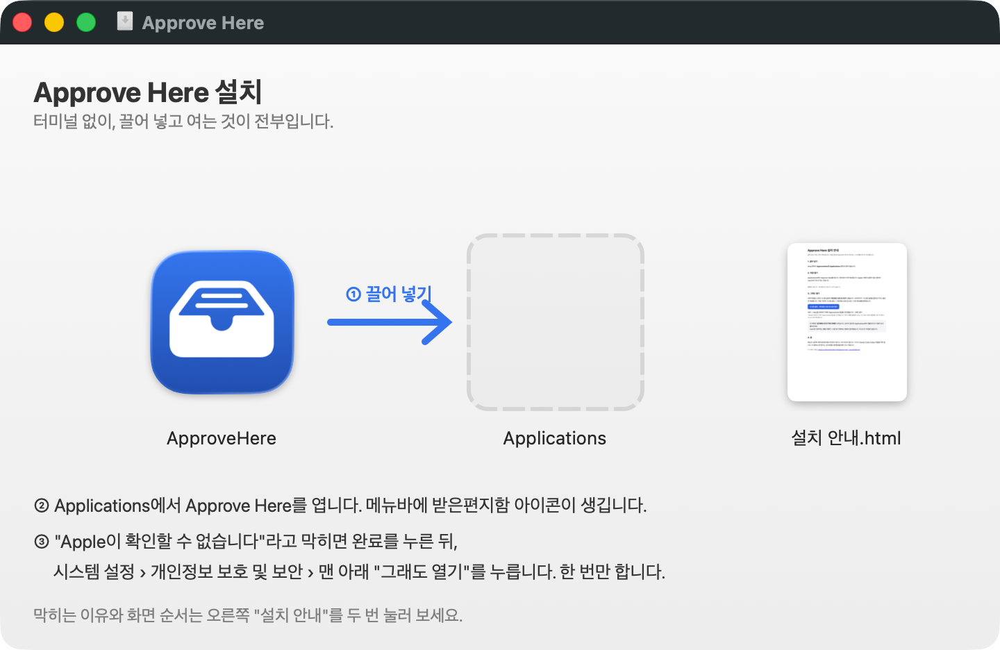
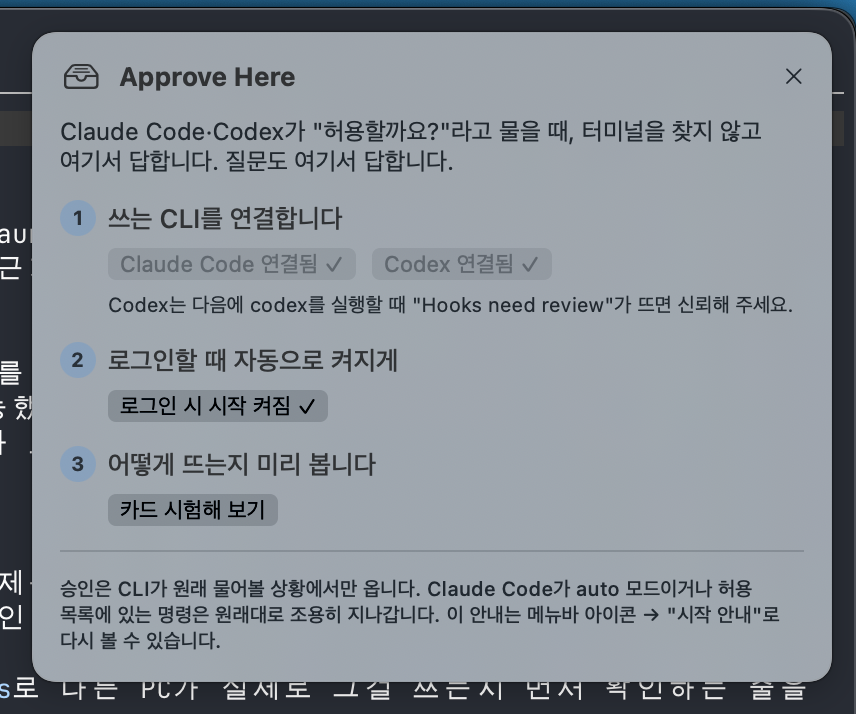
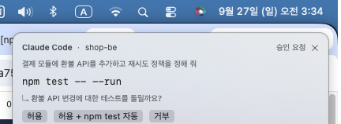
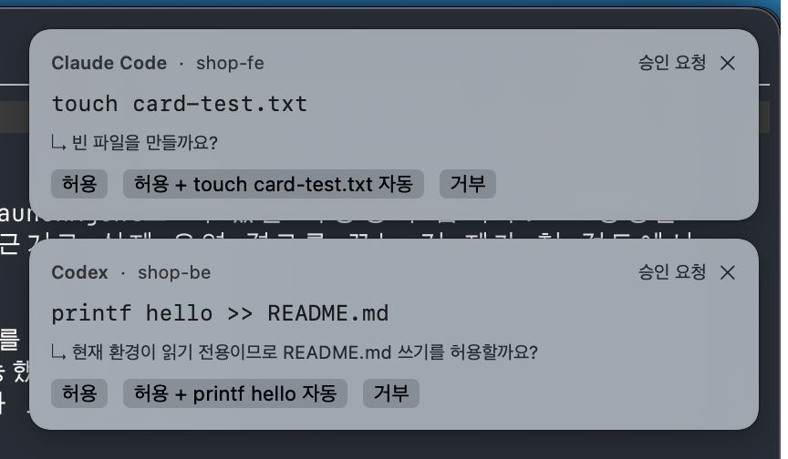
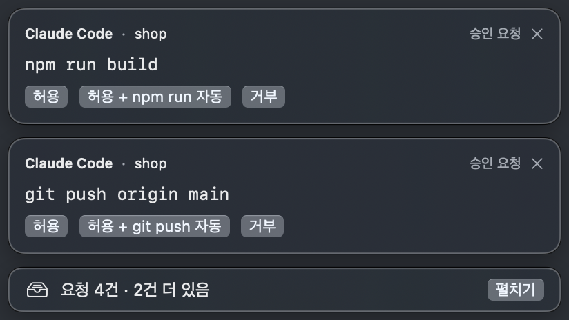
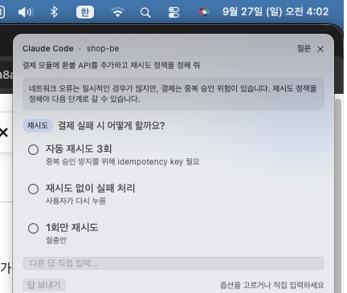
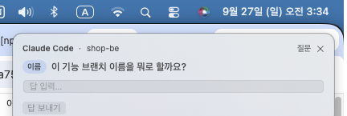
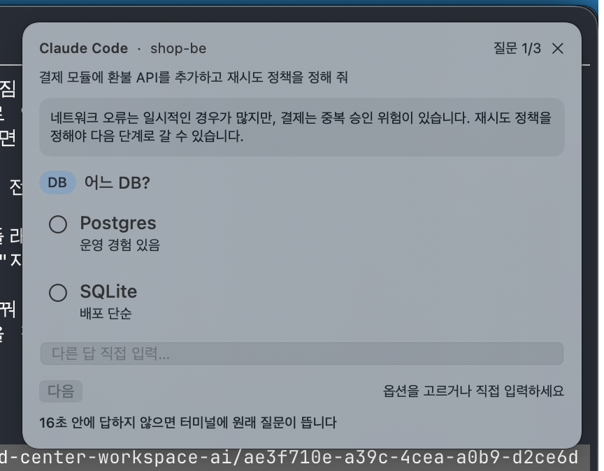
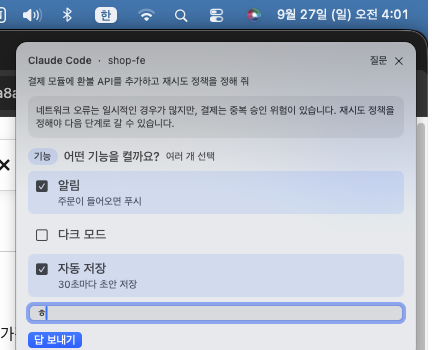

# Approve Here 사용 가이드

Mac에서 Claude Code나 Codex를 쓰는데, 터미널 창을 찾아다니며 "허용할까요?"에 답하는 게 귀찮은 사람을 위한 안내입니다. 터미널을 열 일은 없습니다. 아래 화면은 모두 실제 앱에서 찍었습니다.

## 1. 내려받아 설치

[Release](https://github.com/SungHoonKim-Ski/approve-here/releases/latest)에서 ApproveHere.dmg를 내려받아 엽니다. 앱을 오른쪽 Applications 폴더로 끌어 넣습니다.



## 2. 처음 열기

Applications에서 Approve Here를 엽니다. Apple 서명이 없는 앱이라 처음 한 번은 macOS가 막을 수 있습니다. "확인되지 않은 개발자" 안내가 뜨면 시스템 설정 → 개인정보 보호 및 보안 맨 아래의 "그래도 열기"를 누릅니다. Finder에서 앱을 우클릭 → 열기로도 됩니다.

앱은 창이 없습니다. 메뉴바(화면 위 오른쪽 아이콘 줄)에 받은편지함 모양 아이콘이 하나 생깁니다.


## 3. 시작 안내에서 연결 켜기

처음 열면 화면 오른쪽 위에 시작 안내가 뜹니다.



1. 쓰는 CLI를 연결합니다. Claude Code, Codex 중 쓰는 것을 누르면 앱이 각 CLI의 설정 파일(`~/.claude/settings.json`, `~/.codex/hooks.json`)에 훅 한 줄을 넣습니다. 다른 설정은 건드리지 않습니다.
2. 로그인 시 시작을 켜 두면 Mac을 켤 때 같이 뜹니다.
3. 카드 시험해 보기를 누르면 승인 카드가 어떻게 뜨는지 가짜 카드로 미리 볼 수 있습니다.

Codex는 새 훅을 처음 만나면 신뢰 확인을 요구합니다. 연결을 켠 뒤 처음 `codex`를 실행하면 "Hooks need review"가 뜨는데, Trust all and continue를 고르면 됩니다.

이 안내는 메뉴바 아이콘 → 시작 안내로 언제든 다시 볼 수 있습니다.

## 4. 승인 카드

Claude Code나 Codex가 명령을 실행하기 전에 허락을 구하면 화면 오른쪽 위에 카드가 뜹니다. 어느 앱을 보고 있어도 뜹니다.



카드 머리에는 어느 CLI의 어느 프로젝트인지가, 그 아래에는 그 세션에 마지막으로 시킨 일이 적힙니다. 가운데는 실행하려는 명령과 agent가 붙인 설명입니다.

버튼은 셋입니다. 허용은 이번만 허용합니다. "허용 + `npm test` 자동"은 허용하면서 이 명령 접두를 기억해 앞으로 묻지 않게 합니다. 거부는 거부합니다. `rm`, `sudo`처럼 되돌릴 수 없는 명령에는 "자동" 버튼이 나오지 않습니다.

✕를 누르면 카드만 숨습니다. 요청은 메뉴에 남아 있어 거기서 답할 수 있습니다.

여러 세션이 동시에 물으면 카드가 쌓입니다.



두 장까지만 펼치고 나머지는 "N건 더 있음" 한 줄로 접습니다. 펼치기를 누르면 다 보이고, 접힌 요청도 메뉴에서 답할 수 있습니다.



### 터미널에서도 답할 수 있습니다

카드를 놓쳐도 됩니다. 어느 요청이든 그 세션의 터미널에서 답할 수 있고, 먼저 답한 쪽이 이깁니다.

- Claude Code 승인: 카드와 터미널 프롬프트가 함께 뜹니다. 카드에서 답하면 터미널 프롬프트가 닫힙니다.
- Claude Code 질문, Codex 승인 (tmux 안에서 실행 중일 때): 카드와 터미널 다이얼로그가 함께 뜹니다. 카드에서 고르면 앱이 그 터미널 다이얼로그에 대신 입력하고, 터미널에서 답하면 카드가 사라집니다. 카드에 "터미널에도 떠 있습니다"라고 적혀 있습니다. Claude Code 질문과 Codex 승인 모두 실제 세션으로 확인했습니다(Codex 거부는 Esc라서 Codex가 "다르게 지시해 달라"는 중단으로 받습니다).
- Claude Code 질문, Codex 승인 (tmux 밖): 카드가 먼저 뜨고, 20초 안에 답하지 않으면 터미널에 원래 다이얼로그가 뜹니다. 카드에 남은 시간이 보입니다.

## 5. 질문 카드

Claude가 선택지를 주며 물을 때(`AskUserQuestion`)는 질문 카드가 뜨고 소리가 납니다.



위쪽 상자는 질문 직전에 Claude가 한 설명, 즉 왜 묻는지입니다. 선택지는 설명과 함께 목록으로 나옵니다. 하나를 고르고 답 보내기를 누르면 답이 갑니다. 선택지에 없는 답은 입력칸에 적고 Enter를 누르거나 답 보내기를 누릅니다. ✕를 누르면 앱에서 답하지 않고 그 세션의 원래 다이얼로그로 넘어갑니다.

선택지가 없는 질문은 입력칸만 뜹니다.



질문이 여럿이면 카드에 하나씩 차례로 뜹니다. 고르면 다음 질문으로 넘어가고("질문 2/3"), 마지막에 답 보내기를 누르면 전부 한 번에 전달됩니다. 이전으로 돌아가 고칠 수 있습니다.



같은 세션이 여러 요청을 기다려도 카드는 한 장만 뜹니다. 처리하면 다음 요청이 그 자리에 뜨고, 머리에 "이 세션에 N건 더"가 보입니다.

여러 개를 고르는 질문은 "여러 개 선택" 표시와 체크박스로 나옵니다. 고른 것이 모두 답으로 갑니다.



Claude는 카드에서 고른 답을 그대로 받습니다. 터미널에는 "User answered Claude's questions: → (답)"으로 표시됩니다. 카드를 놓쳤으면 터미널 다이얼로그에서 답하면 되고, 그러면 카드는 사라집니다.

## 6. 메뉴

메뉴바 아이콘을 누르면 이렇게 보입니다.

```
Claude Code   연결됨 ✓        ← 눌러서 켜고 끔
Codex         연결됨 ✓
──────────────
(대기 중인 요청 목록)         ← 카드를 닫았어도 여기서 답할 수 있음
──────────────
시작 안내
카드 시험해 보기
도움말 (README)
──────────────
로그인 시 시작
기록 폴더 열기
종료
```

아이콘이 받은편지함이면 대기가 없고, 옆에 숫자가 붙으면 그 수만큼 기다리는 요청이 있습니다. `⚠︎`는 Node.js를 못 찾았다는 뜻입니다.

## 7. 승인이 오지 않을 때

카드는 CLI가 원래 물어볼 상황에서만 옵니다.

Claude Code가 `auto` 모드면 CLI 자체가 묻지 않으니 카드도 없습니다. 터미널에서 `shift+tab`으로 모드를 바꾸거나 `claude --permission-mode default`로 띄우세요. `permissions.allow`에 있는 명령(예: `git`, `npm`을 이미 허용해 둔 경우)도 원래 묻지 않으니 오지 않습니다.

앱이 꺼져 있으면 아무것도 바뀌지 않습니다. CLI가 원래 프롬프트를 띄웁니다.

## 8. 끄기·지우기

잠깐 끄려면 메뉴에서 종료합니다. 훅은 남아 있지만 앱이 없으면 CLI가 원래대로 묻습니다.

연결을 끊으려면 메뉴에서 "Claude Code 연결됨" 또는 "Codex 연결됨"을 눌러 끕니다. 설정 파일에서 우리 줄만 빠집니다.

완전히 지우려면 연결을 끈 뒤 앱을 지우고, 기록 폴더 `~/.approve-here`를 지웁니다.

## 9. 문제가 있을 때

메뉴에서 기록 폴더를 엽니다. `app.log`(앱), `daemon.log`(대기함), `requests.jsonl`(모든 요청과 결정)이 있습니다. 증상별 확인 순서는 [README의 "안 될 때"](../README.md#안-될-때)에 있습니다.

## Node.js가 필요합니다

카드 뒤에서 일하는 훅은 Node.js로 돕니다. 코드는 앱 안에 들어 있고, Node만 시스템에 있으면 됩니다. Claude Code나 Codex를 npm으로 설치했다면 이미 있습니다. 없으면 시작 안내가 내려받기 링크를 보여 줍니다.
